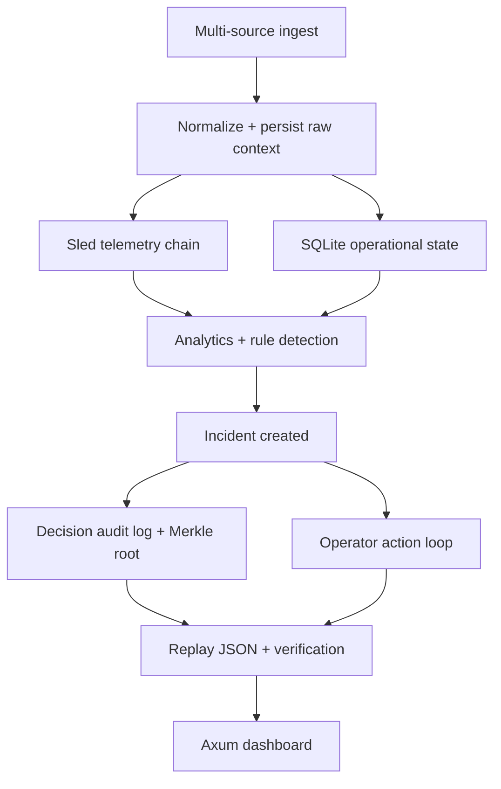

# Vigil Architecture

## Positioning

Vigil is the operational decision layer built on top of the existing ForgeMesh industrial data substrate.

ForgeMesh remains responsible for:

- immutable telemetry ingestion
- Merkle-DAG lineage
- local-first storage
- web delivery over Axum + WebSocket

Vigil adds:

- incident state
- decision audit logging
- replay and integrity verification
- operator actions
- read-first copilot answers logged into replay
- health surfaces for operational credibility

## System Flow

## Storage Model

### Sled

- immutable telemetry chain
- latest sensor head indexes
- fast local writes

### SQLite

- `machines`
- `raw_events`
- `maintenance_tickets`
- `incidents`
- `decision_audit_log`
- `operator_actions`
- `pipeline_runs`

This split keeps the original historian strengths while making incident querying and state transitions straightforward.

## Incident Engine

Rules are intentionally frozen for v1:

- `temp_spike`
- `vibration_anomaly`
- `multi_machine_cascade`

Detection path:

1. pull current telemetry history from Sled
2. compute rolling stats
3. create candidate incidents from rules
4. deduplicate against open incidents
5. persist incident state
6. capture audit snapshot and Merkle root

## Replay

Replay payloads combine:

- timeline of telemetry events
- linked raw operational context
- rule identifiers
- reasoning text
- Merkle root and proof array
- operator action history
- copilot response history

## UX Surfaces

- incident list
- incident detail
- incident copilot
- replay / audit pane
- health card

The dashboard remains single-page and Axum-served to preserve local-first operation.

## Copilot Layer

The current copilot is read-only by design. It reuses the same incident and replay records rather than introducing a second knowledge store.

- provider: embedded deterministic engine
- tools: incident detail, replay, health snapshot, maintenance context, sensor history
- guardrails: read-only allowlist, structured responses, audit persistence
- future path: optional external model behind the same schema once evaluation and trust are strong enough

Detailed rollout guidance lives in [docs/vigil-agent.md](/Users/apinzon/Desktop/Active%20Projects/ForgeMesh/docs/vigil-agent.md).
