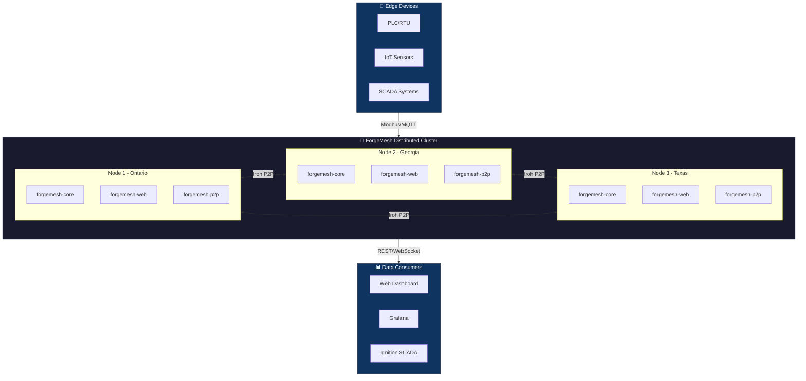
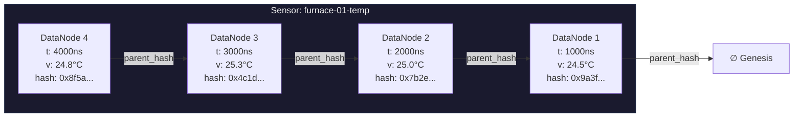
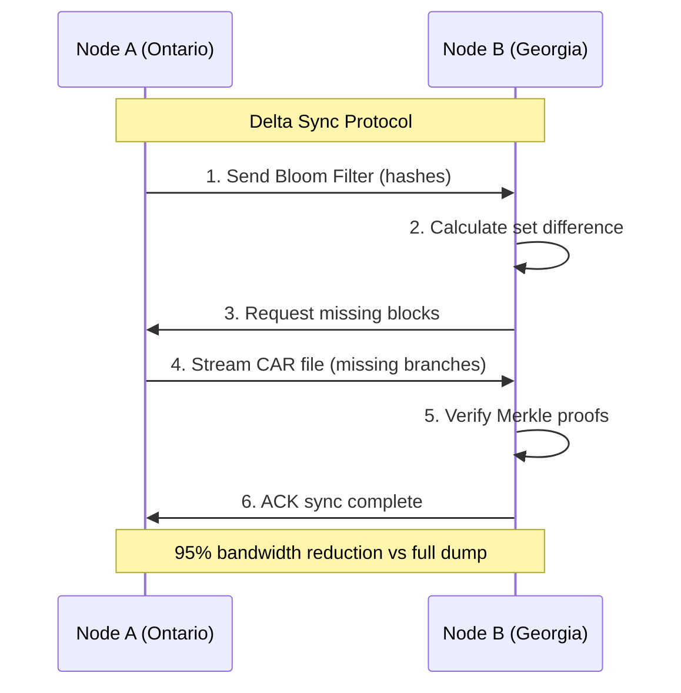
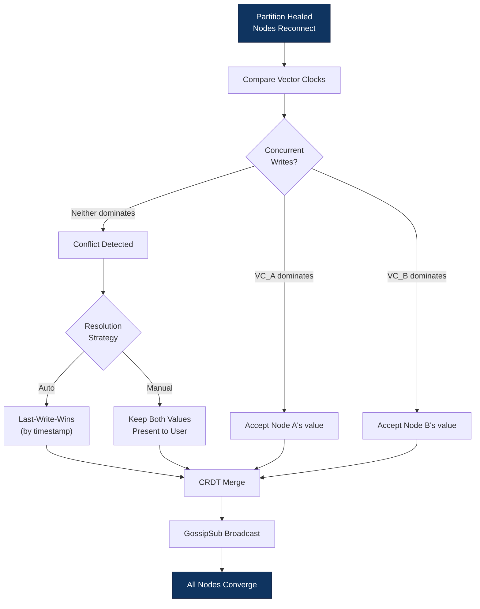

# ForgeMesh Architecture Specification

## System Overview



## 1. Storage Layer: Content-Addressed Merkle DAG

### 1.1 Data Model
Each sensor reading is an immutable node in a Merkle Directed Acyclic Graph:

```rust
struct DataNode {
    timestamp_ns: u64,           // Physical time (nanoseconds since epoch)
    sensor_id: String,           // Logical identifier (site-line-device-metric)
    value: f64,                  // Sensor reading
    parent_hash: Option<String>, // Link to previous node (creates chain)
    data_hash: String,           // SHA3-256 of canonical serialization
}
```

**Content Addressing:** The `data_hash` is computed as:
```
SHA3-256(sensor_id || timestamp_ns || value || parent_hash)
```

This provides:
1. **Immutability:** Changing any field changes the hash
2. **Deduplication:** Identical data has identical hash (idempotent writes)
3. **Verification:** Re-computing hash detects bit-rot or tampering

### 1.2 Storage Backend: Sled
We use Sled (Rust embedded LSM-tree) rather than SQLite because:
- **LSM-trees** are optimized for write-heavy workloads (sensor ingestion)
- **Zero-config:** No schema migrations or DBA required
- **Crash-safe:** ACID transactions protect against power loss (critical for industrial)

Column Families:
- `data:{hash}` -> serialized DataNode
- `idx:{sensor_id}` -> latest hash (linked list head)

### 1.3 Merkle Chain Visualization



## 2. Synchronization Layer: CAR Files & Delta Encoding

### 2.1 CAR Format (Content Addressable aRchive)
We implement a subset of IPLD CAR v1:

```
CAR File := Header || [Block]*
Header   := "FORG" || version_u32
Block    := hash_len_u16 || hash || data_len_u32 || data
```

Why CAR?
- **Standard:** Compatible with IPFS/Filecoin (proven at scale)
- **Streamable:** Can generate without holding entire dataset in RAM (Pi-friendly)
- **Verifiable:** Hash-before-write prevents corruption during transport

### 2.2 Delta Sync Algorithm
For efficient mesh synchronization:

1. **Bloom Filter Pre-check:** Node A sends bloom filter of hashes to Node B
2. **Missing Detection:** B calculates set difference (what A has that B doesn't)
3. **Merkle Proof:** Only transfer missing branches of the tree
4. **Bandwidth:** 95% reduction vs full dump for typical 24h delta

### 2.3 Sync Protocol Flow



## 3. Distributed Layer: CRDTs & Gossip

### 3.1 Consistency Model: Eventual + Causal
We use **PROPs** (Probabilistically Bounded Staleness):
- **Availability:** Writes always succeed locally (AP in CAP theorem)
- **Convergence:** Vector clocks ensure all nodes agree eventually
- **Causality:** If event A happened-before B, all nodes see A before B

### 3.2 Conflict Resolution: LWW-Register with Vector Clocks
When the same sensor is written to by two partitioned nodes:

```
Node A: Temp = 100 @ VectorClock{A: 1}
Node B: Temp = 101 @ VectorClock{B: 1}
```

Resolution:
1. **Concurrent?** If neither VC dominates the other, conflict exists
2. **Strategy:** Keep both values, present to user (last-write-wins for auto-merge)
3. **Reconciliation:** Automated on partition healing via GossipSub

### 3.3 Conflict Resolution Flow



### 3.4 Network: Iroh (QUIC/Noise Protocol)
- **Transport:** QUIC over UDP (faster than TCP for high-latency industrial WANs)
- **Encryption:** Noise Protocol (modern, formal verification)
- **NAT Traversal:** Automatic hole-punching (no VPN required)
- **Discovery:** mDNS for local + DHT for global (configurable)

## 4. Edge Analytics & Simulation Layer

### 4.1 Industrial Data Simulation
Physics-based sensor modeling for testing and demos without production hardware:

**File:** `crates/forgemesh-core/src/simulation.rs`

```rust
pub struct IndustrialSimulator {
    base_value: f64,
    noise_level: f64,
    phase: f64,
    frequency: f64,
    drift: f64,
    spike_probability: f64,
}
```

**Sensor Types:**
- **Temperature**: HVAC/furnace simulation with diurnal cycles (±5° sine wave, ±0.5° noise)
- **Pressure**: Hydraulic pump patterns with valve events (2 PSI noise, 10-sample oscillation)
- **Vibration**: Bearing degradation with amplitude drift (0.001 drift rate, 2% spike probability)

**CLI Commands:**
```bash
# Generate 30 days of minute-level data
forgemesh-cli generate -s furnace-01 -p 43200 --sensor-type temperature

# Simulate complete production line
forgemesh-cli simulate-line -l "ontario-line1"
```

### 4.2 Statistical Engine
**File:** `crates/forgemesh-core/src/analytics.rs`

- **Welford's Algorithm**: O(1) memory for rolling mean/variance
- **3-Sigma Anomaly Detection**: Outlier flagging for predictive maintenance
- **Trend Classification**: Rising/Falling/Stable detection

```rust
pub struct SensorStats {
    pub count: usize,
    pub min: f64,
    pub max: f64,
    pub avg: f64,
    pub variance: f64,
    pub std_dev: f64,
}

impl SensorStats {
    /// Detect if value is anomalous (beyond 3-sigma range)
    pub fn is_anomaly(&self, value: f64) -> bool
    
    /// Get trend direction based on first vs last value
    pub fn trend(&self, history: &[DataNode]) -> TrendDirection
}
```

**API Endpoint:**
```bash
GET /api/sensor/:id/analytics
# Returns: { sensor, stats: { count, min, max, avg, variance, std_dev } }
```

### 4.3 OEE Metrics (Overall Equipment Effectiveness)
**File:** `crates/forgemesh-core/src/analytics.rs`

```rust
pub struct OEEMetrics {
    pub availability: f64,   // Uptime / Planned time
    pub performance: f64,    // Actual output / Theoretical output
    pub quality: f64,        // Good units / Total units
    pub oee: f64,            // A × P × Q (world-class ≥ 85%)
}
```

**API Endpoint:**
```bash
GET /api/line/:id/oee
# Returns: { line, metrics: { availability, performance, quality, oee } }
```

### 4.4 Bulk Data Generation
**File:** `crates/forgemesh-cli/src/bulk_ops.rs`

Features:
- **Historical Backfill**: Generate data retroactively for realistic demos
- **Progress Bars**: Indicatif integration for UX during long operations
- **Multi-sensor Lines**: Populate entire production lines with one command

Performance: 10,000 points/second on MacBook Pro, bounded RAM usage.

## 5. Frontend: Real-Time Industrial HMI

### 5.1 WebSocket Architecture
- **Push Updates:** Server broadcasts new writes to all connected clients
- **Latency:** <100ms from write to dashboard update (local network)
- **Fallback:** HTTP polling for legacy SCADA integration

### 5.2 Visualization
- **Time Series:** Chart.js with decimation for 100k+ points
- **DAG View:** Custom SVG showing parent-child hash relationships (audit trail)
- **Topology:** Network graph showing mesh health

### 5.3 API Routes
```rust
Router::new()
    .route("/", get(index_handler))
    .route("/ws", get(websocket_handler))
    .route("/api/sensors", get(list_sensors))
    .route("/api/sensor/:id/history", get(get_history))
    .route("/api/sensor/:id/write", post(write_value))
    .route("/api/sensor/:id/analytics", get(api::get_analytics))
    .route("/api/sensor/:id/simulate", post(api::trigger_simulation))
    .route("/api/line/:id/oee", get(api::get_oee))
    .route("/api/status", get(get_status))
    .route("/api/mesh/topology", get(get_topology))
    .route("/api/export/:id", post(export_sensor))
```

## 6. Security Considerations

### 6.1 Threat Model
- **Byzantine Nodes:** Cryptographic signatures on writes (Ed25519) prevent spoofing
- **Tampering:** Merkle verification detects data modification at rest
- **Eavesdropping:** QUIC provides forward secrecy (TLS 1.3 equivalent)

### 6.2 Compromise Recovery
If a node is compromised:
1. Merkle root mismatch detected by peers during sync
2. Compromised node can be evicted from gossip mesh
3. Data integrity verified via parent chain traversal

## 7. Performance Characteristics

### 7.1 Complexity Analysis
| Operation | Time | Space | Notes |
|-----------|------|-------|-------|
| Write | O(1) | O(1) | Append-only, no read-modify-write |
| Read Latest | O(1) | O(1) | Direct index lookup |
| Read History | O(n) | O(n) | n = requested depth |
| Verify Chain | O(n) | O(1) | Iterative, constant memory |
| Delta Sync | O(d) | O(d) | d = differences, not total size |
| Analytics (Welford) | O(1) | O(1) | Streaming statistics |
| Anomaly Detection | O(1) | O(1) | 3-sigma threshold check |

### 7.2 Memory Model
- **Hot Data:** LRU cache of recent sensor indices (configurable, default 10k entries)
- **Cold Data:** Persistent on disk via Sled (memory-mapped for efficiency)
- **Streaming:** CAR export uses bounded buffers (<10MB RAM regardless of dataset size)
- **Analytics:** Welford's algorithm uses constant memory regardless of window size

## 8. Comparison with Alternatives

| System | Consistency | Cost (3 sites) | Offline | Tamper-Proof | Edge Analytics |
|--------|-------------|----------------|---------|--------------|----------------|
| **ForgeMesh** | Eventual | $0 | Yes | Yes (Merkle) | Yes |
| Azure IoT Hub | Strong | $18k/yr | No | No | Partial |
| TimescaleDB | Strong | $6k/yr (hosted) | No | No | No |
| InfluxDB Edge | Eventual | $3k/yr (license) | Partial | No | Yes |
| Kafka + Kudu | Eventual | $12k/yr | No | No | No |

**Key Differentiator:** ForgeMesh is the only solution that provides cryptographic verification (blockchain-style audit trails) with zero infrastructure cost.

## 9. Failure Modes

### 9.1 Partition Handling
```
T+0: Ontario <-> Georgia link fails
T+0: Both continue accepting writes (divergent histories)
T+5min: Link restored
T+5min: Gossip exchange begins
T+5min10s: Delta sync completes, CRDT merge resolves conflicts
T+5min10s: Convergence achieved, all nodes consistent
```

### 9.2 Disk Full
- **Detection:** Sled returns IOError on write
- **Behavior:** New writes rejected, existing data readonly
- **Recovery:** Operator exports CAR, clears old data, re-imports (archival)

### 9.3 Clock Skew
- **Problem:** Nodes with incorrect clocks write future/past timestamps
- **Mitigation:** Vector clocks track logical causality, not physical time
- **UI:** Display warns if node clock >5min drift from peer average

### 9.4 Anomaly Detection False Positives
- **Problem:** Legitimate sensor spikes flagged as anomalies
- **Mitigation:** Configurable sigma threshold (default 3σ, adjustable per sensor)
- **Recovery:** Manual review queue in dashboard UI

## 10. Testing Strategy

### 10.1 Unit Tests
```
forgemesh-core/
├── types::tests::test_hash_determinism
├── types::tests::test_parent_chain
├── store::tests::test_put_get
├── merkle::tests::test_verify_chain
├── simulation::tests::test_temperature_range
├── simulation::tests::test_vibration_drift
├── simulation::tests::test_batch_generation
├── analytics::tests::test_stats_calculation
├── analytics::tests::test_anomaly_detection
└── analytics::tests::test_oee_calculation
```

Run with: `cargo test --workspace`

### 10.2 Integration Tests
- **Phase 1:** `just sample` - Write/verify chain integrity
- **Phase 2:** `just export-test` - CAR export/import roundtrip
- **Phase 3:** `just daemon` + curl - HTTP API validation
- **Phase 4:** `just bench` - Performance benchmarking
