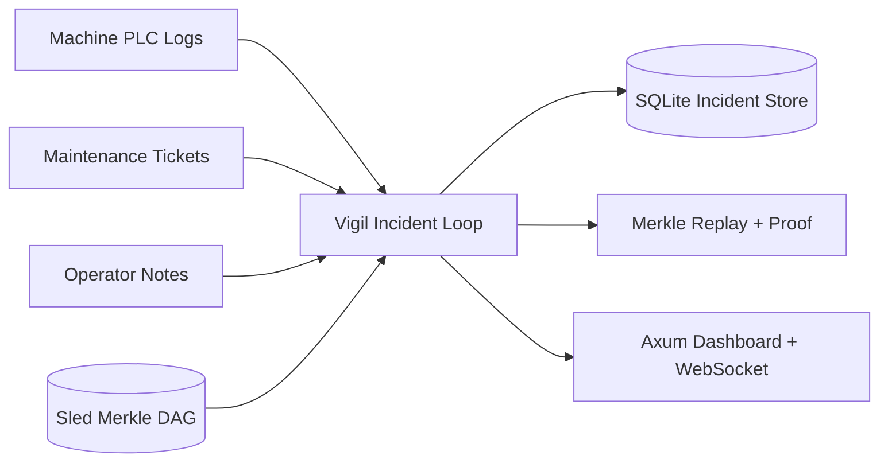

# Vigil

**Operational Incident Intelligence Platform**

Evolved from ForgeMesh distributed industrial historian into a closed-loop decision system with explainable incidents, operator actions, and Merkle-DAG-backed replay.

[](https://rust-lang.org)
[](LICENSE)
[](https://github.com/AngelP17/vigil/actions)

## Problem

Shift supervisors lose time hunting across siloed machine logs, maintenance records, and operator notes. Raw anomalies are not enough. Teams need explainable incidents, recommended actions, and trustworthy replay of why a system made a decision.

## Solution

Vigil ingests noisy multi-source manufacturing data, detects explainable incidents, recommends next actions, records operator decisions, and preserves Merkle-DAG-backed replay for integrity and trust.

## Workflow

`Ingest → Detect → Explain → Recommend → Act → Replay`

## Why This Matters in High-Stakes Operations

- local-first operation for degraded or partitioned industrial networks
- human-in-the-loop action handling instead of black-box anomaly dashboards
- replayable incident reasoning with Merkle-backed integrity verification
- production-minded persistence split: Sled for telemetry, SQLite for operational workflow state

## Key Features

- Three v1 incident patterns: `temp_spike`, `vibration_anomaly`, `multi_machine_cascade`
- Three data sources: machine logs, maintenance tickets, operator notes
- Three operator actions: acknowledge, assign maintenance, reroute, override, resolve
- Incidents list, incident detail, and replay/audit surfaces in the Axum dashboard
- Read-first incident copilot for summary, explanation, handoff, and bounded Q&A
- Local demo seeding with nulls, duplicates, delays, out-of-order events, and conflicting notes

## Architecture



Telemetry remains in the ForgeMesh substrate:

- Sled-backed immutable telemetry chains
- Merkle verification for tamper evidence
- Axum + WebSocket dashboard
- local-first CLI and demo workflow

Vigil adds:

- incident persistence and status transitions
- operator action recording
- decision audit log with reasoning snapshots
- health endpoint and incident/replay APIs

## Quick Start

```bash
cargo build

# Seed noisy data and create incidents
cargo run -p vigil-cli -- seed-demo
cargo run -p vigil-cli -- detect

# Launch Vigil
cargo run -p vigil-cli -- daemon --port 8080
```

Open `http://localhost:8080`.

Useful commands:

```bash
# Verify telemetry chain integrity
cargo run -p vigil-cli -- verify -s ontario-line1-temp

# Export sample data again
./scripts/seed_demo_data.sh

# Run the full local demo flow
./scripts/run_demo_flow.sh
```

## API

```text
GET  /api/incidents
GET  /api/incidents/:id
POST /api/incidents/:id/copilot
GET  /api/incidents/:id/replay
POST /api/incidents/:id/actions
GET  /api/health
GET  /api/copilot/status
GET  /api/sensors
GET  /api/sensor/:id/history
GET  /api/sensor/:id/analytics
```

## Integrity and Replay

Each incident stores:

- timeline snapshot
- rule fired
- reasoning text
- Merkle root
- operator action history

Replay responses include the verification string:

```text
Valid Merkle path - data untampered
```

Copilot responses are also written into replay as read-only audit entries.

## Read-First Copilot

The copilot is intentionally narrow:

- summarizes the incident
- explains why the incident fired
- prepares a shift handoff note
- answers bounded read-only questions grounded in incident, replay, health, and telemetry context

It does not execute actions or change state. The implementation details and 30-day rollout are documented in [docs/vigil-agent.md](/Users/apinzon/Desktop/Active%20Projects/ForgeMesh/docs/vigil-agent.md).

## Demo Assets

- script: [demo/demo_script.md](/Users/apinzon/Desktop/Active%20Projects/ForgeMesh/demo/demo_script.md)
- scenario: [demo/demo_scenario.md](/Users/apinzon/Desktop/Active%20Projects/ForgeMesh/demo/demo_scenario.md)
- screenshots directory: [demo/screenshots/README.md](/Users/apinzon/Desktop/Active%20Projects/ForgeMesh/demo/screenshots/README.md)

### Screenshots


## Why Vigil Fits High-Stakes Ops Roles

- end-to-end ownership of an operational incident workflow
- explainable decision support under messy, conflicting data
- human-in-the-loop actions with status transitions and audit history
- cryptographic auditability and replay surfaced directly in product UX
- modular Rust backend design with clear storage, API, and workflow boundaries
