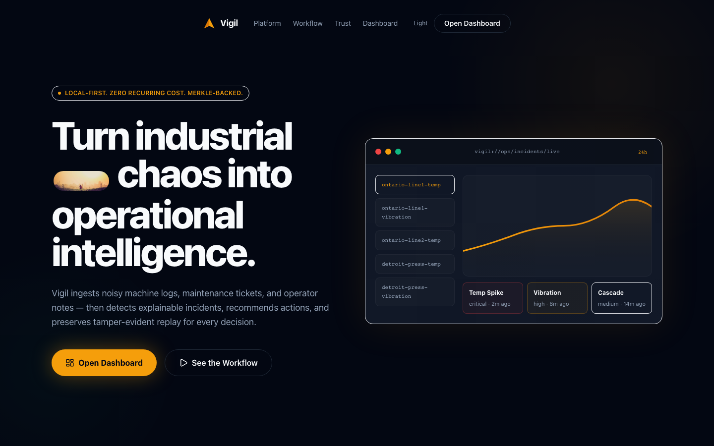
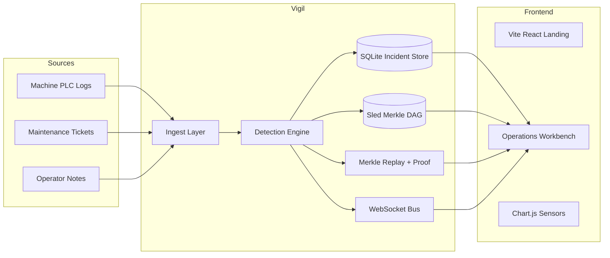
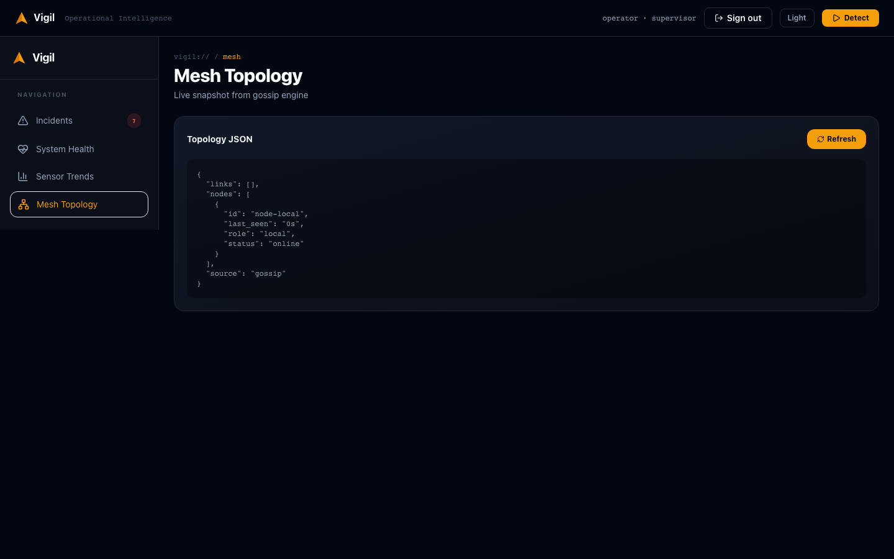

# Vigil

**Operational Incident Intelligence Platform**



Evolved from ForgeMesh distributed industrial historian into a closed-loop decision system with explainable incidents, operator actions, and Merkle-DAG-backed replay.

*Screenshot is a headless Chromium capture of `/` only (not your IDE). Regenerate with [`demo/screenshots/capture-landing.mjs`](demo/screenshots/capture-landing.mjs) while the daemon is running (`cargo run -p vigil-cli -- daemon --port 8080`). If GitHub still shows an old picture, hard-refresh the README or wait for CDN cache — the asset file is `docs/readme-vigil-landing.png`.*

[](https://rust-lang.org)
[](LICENSE)
[](https://github.com/AngelP17/ForgeMesh/actions)

*CI badge targets the default remote for this project (`AngelP17/ForgeMesh`). If you fork, point the badge at your repo.*

## Problem

Shift supervisors lose time hunting across siloed machine logs, maintenance records, and operator notes. Raw anomalies are not enough. Teams need explainable incidents, recommended actions, and trustworthy replay of why a system made a decision.

## Solution

Vigil ingests noisy multi-source manufacturing data, detects explainable incidents, recommends next actions, records operator decisions, and preserves Merkle-DAG-backed replay for integrity and trust.

**Zero recurring cost (product goal):** the default path is self-hosted on your hardware—no required SaaS, cloud database, LLM API, or subscription. Optional hooks (e.g. Slack incoming webhooks) are add-ons and never required for incidents, detection, replay, or the dashboard.

## Workflow

`Ingest → Detect → Explain → Recommend → Act → Replay`

## Why This Matters in High-Stakes Operations

- local-first operation for degraded or partitioned industrial networks, with **$0 recurring vendor cost** on the core hot path (see Solution above)
- human-in-the-loop action handling instead of black-box anomaly dashboards
- replayable incident reasoning with Merkle-backed integrity verification
- production-minded persistence split: Sled for telemetry, SQLite for operational workflow state

## Key Features

- Three v1 incident patterns: `temp_spike`, `vibration_anomaly`, `multi_machine_cascade`
- Three data sources: machine logs, maintenance tickets, operator notes
- **Five** operator actions: acknowledge, assign maintenance, reroute, override, resolve
- **Elite React Frontend:** Vite + React + TypeScript + Tailwind CSS with GSAP motion, gapless bento grids, and amber-accented industrial design
- **Operations Workbench:** Incident queue, live triage stream, detail view with replay, sensor trends (Chart.js), mesh topology, and Slack integration
- **Merkle-Backed Replay:** Cryptographic verification with proof arrays and tamper-evident audit trails
- Read-first incident copilot for summary, explanation, handoff, and bounded Q&A
- Local demo seeding with nulls, duplicates, delays, out-of-order events, and conflicting notes
- Zero recurring cost: self-hosted, no required SaaS or cloud subscriptions

## Architecture



**Stack:**
- **Backend:** Rust, Axum, SQLite, Sled, Merkle-DAG
- **Frontend:** Vite, React, TypeScript, Tailwind CSS, Chart.js, GSAP
- **Network:** WebSocket live updates, optional p2p gossip mesh
- **Integrity:** SHA3-256 telemetry chains, Merkle proof verification

## Quick Start

```bash
cargo build

# Seed noisy data and create incidents
cargo run -p vigil-cli -- seed-demo
cargo run -p vigil-cli -- detect

# Launch Vigil
cargo run -p vigil-cli -- daemon --port 8080
```

Open `http://localhost:8080`.

Useful commands:

```bash
# Verify telemetry chain integrity
cargo run -p vigil-cli -- verify -s ontario-line1-temp

# Export sample data again
./scripts/seed_demo_data.sh

# Run the full local demo flow
./scripts/run_demo_flow.sh
```

## API

```text
GET  /api/incidents
GET  /api/incidents?severity=&status=&machine=&q=&from=&to=&tenant_id=
GET  /api/incidents/export/csv
GET  /api/incidents/:id
GET  /api/incidents/:id/export/json
GET  /api/incidents/:id/export/pdf
GET  /api/incidents/:id/report
GET  /api/incidents/:id/notify/mailto
GET  /api/mesh/topology
POST /api/export/:id
GET  /api/export/:id/car
GET  /api/integrations/slack
PUT  /api/integrations/slack
POST /api/integrations/slack/test
POST /api/incidents/:id/copilot
GET  /api/incidents/:id/replay
POST /api/incidents/:id/actions
POST /api/auth/login
POST /api/auth/logout
GET  /api/auth/me
GET  /api/health
GET  /api/status
GET  /api/copilot/status
POST /api/detection/run
GET  /api/sensors
GET  /api/sensor/:id/history
GET  /api/sensor/:id/analytics
```

Environment (optional):

- `VIGIL_REQUIRE_AUTH=true` — require `Authorization: Bearer <token>` on write/simulation/detection/actions/copilot/reorder
- `VIGIL_ENFORCE_TENANT_SCOPE=true` — when set, signed-in operators with role `operator` (not `supervisor` / `admin`) only see incidents matching their `tenant_id` (CSV/list/detail/replay/exports respect the same rule)
- `VIGIL_SLACK_WEBHOOK_URL` — Slack incoming webhook for **critical** incidents after detection (optional; dashboard **System Health** can also persist a URL in SQLite via `PUT /api/integrations/slack`, `admin`/`supervisor` only — env wins on restart if set)

Default operator (first database init): username `operator`, password `vigil`. Create more with  
`cargo run -p vigil-cli -- create-user --username alice --password '...' --role supervisor`.

## Integrity and Replay

Each incident stores:

- timeline snapshot
- rule fired
- reasoning text
- Merkle root
- operator action history

Replay responses include the verification string (exact characters returned by the API; see `crates/vigil-core/src/audit.rs`):

```text
Valid Merkle path - data untampered
```

Use ASCII hyphen-minus (`U+002D`) between `path` and `data`, not an en dash or em dash.

Copilot responses are also written into replay as read-only audit entries.

## Read-First Copilot

The copilot is intentionally narrow:

- summarizes the incident
- explains why the incident fired
- prepares a shift handoff note
- answers bounded read-only questions grounded in incident, replay, health, and telemetry context

It does not execute actions or change state. The implementation details and 30-day rollout are documented in [docs/vigil-agent.md](docs/vigil-agent.md) (paths in this README are repo-relative to the workspace root).

## Demo Assets

- script: [demo/demo_script.md](demo/demo_script.md)
- scenario: [demo/demo_scenario.md](demo/demo_scenario.md)
- screenshots directory: [demo/screenshots/README.md](demo/screenshots/README.md)
- regenerate PNGs (requires a running daemon and [Playwright](https://playwright.dev/)):  
  `cd demo/screenshots && npm install && npx playwright install chromium && node capture-all.mjs`  
  (with `cargo run -p vigil-cli -- daemon --port 8080` in another terminal)

### Frontend Development

The React frontend lives in `apps/web/`:

```bash
cd apps/web
npm install
npm run dev      # Vite dev server
npm run build    # Production build → dist/
```

Built assets are copied to `crates/vigil-web/static/` and served by Axum.

### Screenshots




## Why Vigil Fits High-Stakes Ops Roles

- end-to-end ownership of an operational incident workflow
- explainable decision support under messy, conflicting data
- human-in-the-loop actions with status transitions and audit history
- cryptographic auditability and replay surfaced directly in product UX
- modular Rust backend design with clear storage, API, and workflow boundaries
