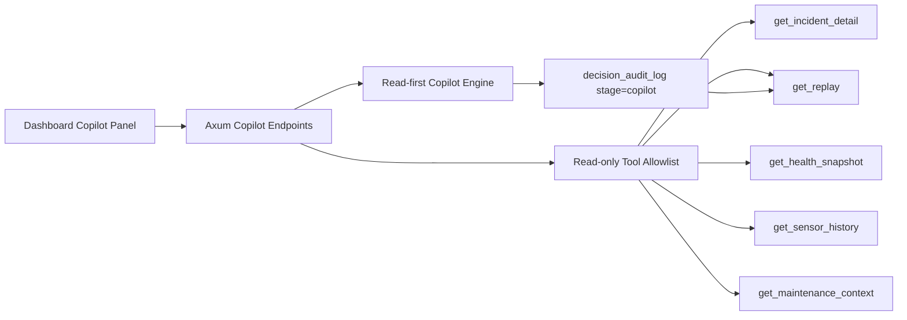

# Vigil Agent

## Goal

Build a narrow, read-first incident copilot before any autonomous action loop.

This release stays intentionally bounded:

- summarize the selected incident
- explain why the incident fired
- prepare a shift handoff note
- answer bounded read-only questions from the incident, replay, and telemetry context

It does **not** change incident state, reroute work, assign maintenance, or write operator actions.

## Architecture

The current engine is deterministic and embedded. That keeps the feature usable offline and preserves a stable contract for a future external model provider.

## Tool List

- `get_incident_detail`
- `get_replay`
- `get_health_snapshot`
- `get_sensor_history`
- `get_maintenance_context`

The tool list is deliberately small. This copies the `open-swe` idea of a constrained tool surface without inheriting coding-agent privileges.

## Middleware Chain

1. Incident existence check
2. Mode validation
3. Read-only tool allowlist
4. Question sanitization and length check
5. Deterministic fact grounding against incident/replay/telemetry payloads
6. Audit persistence into `decision_audit_log`

## Approval Model

- `summary`, `explain`, `handoff`, `ask`: no approval required
- future action proposals: require operator approval
- future write tools: require explicit approval plus audit logging

The product should stay read-only until operator trust, audit visibility, and evaluation quality are strong enough for proposed actions.

## API Surface

- `GET /api/copilot/status`
- `POST /api/incidents/:id/copilot`

The copilot response shape is structured and includes:

- `headline`
- `answer`
- `confidence`
- `guardrail`
- `tools_used`
- `citations`
- `follow_ups`

## UI Changes

- new `Incident Copilot` panel in the incident detail column
- one-click modes for `summary`, `explain`, `handoff`, and `ask context`
- read-only question input
- copilot answers written back into replay under `Copilot Log`

## What To Reuse From open-swe

- tight tool allowlists
- middleware-based guardrails
- auditable workflow steps
- clear provider seams for future orchestration
- small, explicit system surfaces instead of unrestricted agent powers

## What To Ignore From open-swe

- shell access
- repo mutation and PR automation
- coding-agent task loops
- broad autonomous execution

Those are good patterns for engineering automation, not for plant operations.

## 30-Day Rollout

### Week 1

- ship read-only copilot to local demo and internal reviewers
- collect operator feedback on wording, trust, and missing evidence

### Week 2

- add prompt/evaluation fixtures for common incident scenarios
- add explicit missing-evidence and uncertainty reporting

### Week 3

- add optional external model provider behind the same response schema
- keep deterministic fallback enabled for offline/demo use

### Week 4

- add approval-gated action proposals only if read-first usage shows trust and value
- instrument latency, usage, and operator adoption before expanding scope
